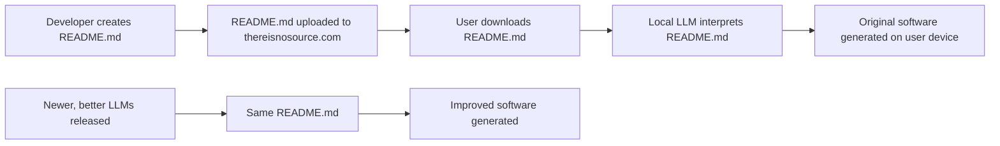

# thereisnosource.com

## The Future of Software Distribution

Welcome to the official GitHub repository for [thereisnosource.com](https://thereisnosource.com) - pioneering a revolutionary approach to software distribution through AI-powered code generation.

**Important Note:** The Bootstrapper Tool previously in this repository is now deprecated. Please use the [TINS-MCP](https://github.com/ScuffedEpoch/TINS-MCP) server for the latest AI-powered code generation capabilities. The original prototype bootstrapper is available in the `tools/llm-bootstrapper` directory for historical reference.

## What is 'Zero Source'?

'Zero Source' redefines software distribution:

1.  **READMEs as the Source:** Instead of code, we distribute detailed README files.
2.  **AI-Powered Code Generation:** Large Language Models (LLMs) locally generate the software from these READMEs on the user's device.
3.  **Evolving with AI:** As LLMs advance, the same README can produce progressively better and more optimized software.
4.  **Standardized Descriptions:** A consistent format for READMEs ensures reliable software reconstruction.

## How It Works

1. **Detailed READMEs:** Developers craft comprehensive READMEs detailing their software's functionality, architecture, and logic.
2. **README Distribution:** Only these READMEs are shared via thereisnosource.com.
3. **Local AI Interpretation:** On the user's device, an LLM interprets the README to generate the original software.
4. **Automatic Upgrades:** As LLM technology improves, the same README can generate better, more optimized software versions without any changes to the README itself.

## Benefits

- **Minimal Distribution:** READMEs are vastly smaller than compiled code.
- **Self-Improving Software:** Code quality evolves with LLM advancements.
- **Reduced Security Risks:** Distributing no executable code minimizes attack vectors.
- **Simplified Upkeep:** Maintain instructions, not complex codebases.
- **Cross-Platform:** READMEs are inherently platform-agnostic.

## Repository Structure

- **[docs/](docs/)** - Comprehensive documentation and specifications
- **[tools/](tools/)** - Utilities to help with Zero Source development

## Getting Started

To begin your Zero Source journey:

1.  **Developer Guide:** Start with the [Developer Guide](docs/developer-guide.md) to understand the fundamentals of creating Zero Source applications.
2.  **Specification:** Next, review the [Specification](docs/specification.md) to learn about the standardized README format.
3.  **Best Practices:** Then, read our [Best Practices](docs/best-practices.md) for tips on crafting effective READMEs that lead to high-quality generated code.

### Examples

Explore these examples to see Zero Source in action:

*   **To-Do List App:** [View README](https://github.com/ScuffedEpoch/TINS/blob/main/examples/todo-app/README.md) | [Try the Demo](https://thereisnosource.com/demo/todo/) (Built with TINS-MCP, VS Code, and Claude 3.7 Sonnet)
*   **Simple Calculator:** [View README](https://github.com/ScuffedEpoch/TINS/blob/main/examples/simple-calculator/README.md)
*   **API Wrapper:** [View README](https://github.com/ScuffedEpoch/TINS/blob/main/examples/api-wrapper/README.md)

The demo for the To-Do List app was generated using the TINS-MCP server, VS Code, and Claude 3.7 Sonnet, showcasing the power of this approach.

## Community

- **[Join our Discord](https://discord.com/invite/uubQXhwzkj)** - Connect with other Zero Source developers
- **[Follow on Twitter](https://x.com/MushroomFleet)** - Stay updated on the latest developments

## License

This project is licensed under the MIT License - see the [LICENSE](LICENSE) file for details.

## Contributing

Contributions are welcome!
