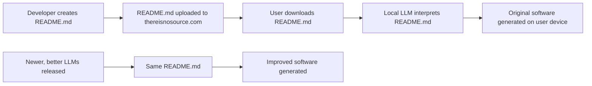

# thereisnosource.com

## The Future of Software Distribution

Welcome to the official GitHub repository for [thereisnosource.com](https://thereisnosource.com) - pioneering a revolutionary approach to software distribution through AI-powered code generation.

**Bootstrapper Tool Deprecated** PLEASE USE THE [TINS-MCP](https://github.com/ScuffedEpoch/TINS-MCP) SERVER! <- April 2025
**NOTE** the Bootstrapper Tool in this Repo is included for developer reference, in the spirit of open source community research. this was the initial prototype for this framework.

## What is "Zero Source"?

Zero Source is a paradigm shift in software distribution where:

1. **Only READMEs are distributed** - No source code is included in releases
2. **LLMs generate code on demand** - Software is reconstructed locally using AI
3. **Instructions evolve with technology** - The same README produces better code as LLMs improve
4. **Standardized format ensures consistency** - A structured approach to describing software functionality 

## How It Works

1. Developers create detailed README.md files that describe their software's functionality, architecture, and logic
2. Only the README.md is distributed through thereisnosource.com
3. On the user's device, an LLM interprets the README.md to build original software that matches the specifications
4. As better LLMs are released, the same README.md generates higher quality implementations without changes

## Benefits

- **Tiny Distribution Size** - READMEs are orders of magnitude smaller than compiled code
- **Automatic Improvements** - Software naturally improves as LLM technology advances
- **Enhanced Security** - No executable code distributed means fewer attack vectors
- **Simplified Maintenance** - Focus on maintaining instructions, not implementation
- **Platform Independence** - Same README works across all platforms and architectures

## Repository Structure

- **[docs/](docs/)** - Comprehensive documentation and specifications
- **[tools/](tools/)** - Utilities to help with Zero Source development

## Getting Started

1. Read the [Best Practices](docs/specification.md) to learn tips on improving readme structure and detail.
2. Check out the [Developer Guide](docs/developer-guide.md) to understand how to create Zero Source applications
3. Review the [specification](docs/specification.md) to learn about the standardized README format
4. Check out the Example: [To-Do List](https://github.com/ScuffedEpoch/TINS/blob/main/examples/todo-app/README.md)
5. Check out the Example: [Calculator](https://github.com/ScuffedEpoch/TINS/blob/main/examples/simple-calculator/README.md)
6. Check out the Example: [api-wrapper](https://github.com/ScuffedEpoch/TINS/blob/main/examples/api-wrapper/README.md)

## Community

- **[Join our Discord](https://discord.com/invite/uubQXhwzkj)** - Connect with other Zero Source developers
- **[Follow on Twitter](https://x.com/MushroomFleet)** - Stay updated on the latest developments

## License

This project is licensed under the MIT License - see the [LICENSE](LICENSE) file for details.

## Contributing

Contributions are welcome!
