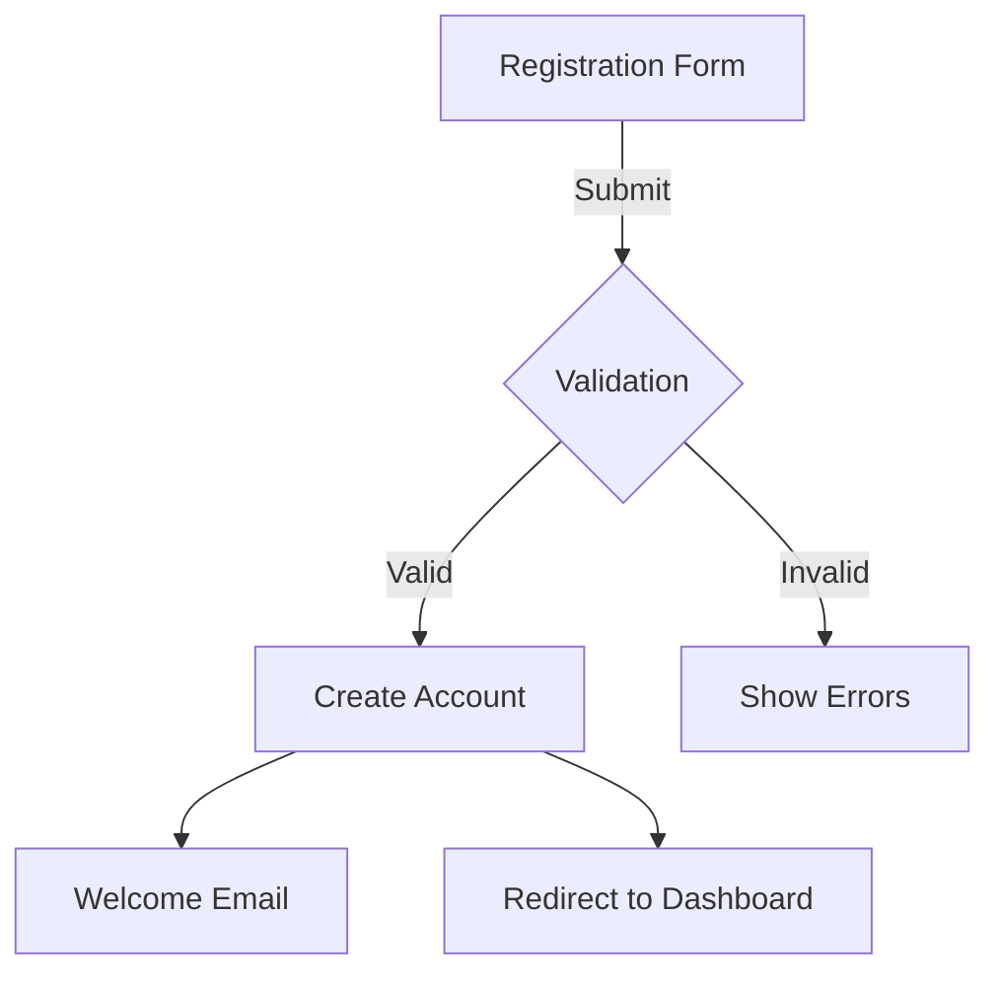

# Zero Source Best Practices

## Introduction

This guide provides best practices for creating effective Zero Source README files that will result in high-quality AI-generated implementations. Following these guidelines will optimize your READMEs for LLM interpretation and improve the consistency and reliability of the generated code.

## General Principles

### 1. Be Explicit, Not Implicit

LLMs perform better when information is explicitly stated rather than implied:

✅ **Good:**
```markdown
The application must validate that the email field contains a valid email address with the format user@domain.tld.
```

❌ **Avoid:**
```markdown
The application should check if emails are valid.
```

### 2. Provide Concrete Examples

Including examples helps clarify your intent:

✅ **Good:**
```markdown
The search function should support filtering by multiple criteria:
- Single property: `search("name:John")`
- Multiple properties: `search("name:John role:admin")`
- Range values: `search("age:30-40")`
```

❌ **Avoid:**
```markdown
The search function should support filtering by properties and ranges.
```

### 3. Use Consistent Terminology

Maintain consistent terminology throughout your README:

✅ **Good:**
```markdown
Users can add items to their shopping cart. The shopping cart displays all added items.
```

❌ **Avoid:**
```markdown
Users can add items to their shopping cart. The basket displays all added items.
```

### 4. Balance Detail and Clarity

Provide enough detail without overwhelming:

✅ **Good:**
```markdown
The authentication system should:
1. Accept username/password combinations
2. Verify credentials against the database
3. Generate a JWT token with user ID and roles
4. Return the token with a 24-hour expiration
```

❌ **Avoid:**
```markdown
The system needs secure authentication with tokens.
```

### 5. Structure Information Hierarchically

Use proper heading levels to create a clear information hierarchy:

✅ **Good:**
```markdown
## User Management
### User Registration
#### Form Fields
#### Validation Rules
#### Success Flow
#### Error Handling
```

❌ **Avoid:**
```markdown
## User Management
User Registration
Form Fields
Validation Rules
```

## Writing Effective Descriptions

### Be Purpose-Oriented

Focus on the purpose and value of the software:

✅ **Good:**
```markdown
A collaborative document editor that enables real-time editing between multiple users, with changes synchronized instantly across all connected clients.
```

❌ **Avoid:**
```markdown
An application for editing documents with collaboration features.
```

### Define Your Audience

Clearly state who the intended users are:

✅ **Good:**
```markdown
This tool is designed for data scientists who need to visualize large datasets quickly without writing custom plotting code.
```

❌ **Avoid:**
```markdown
A data visualization tool for users to see their data.
```

### Highlight Key Differentiators

Explain what makes your software unique:

✅ **Good:**
```markdown
Unlike traditional task managers, this application uses natural language processing to automatically categorize and prioritize tasks based on their content and context.
```

## Specifying Functionality

### Define Clear User Stories

Frame features as user stories:

✅ **Good:**
```markdown
- As a user, I want to filter tasks by date range so that I can focus on upcoming deadlines
- As an administrator, I want to assign tasks to team members so that I can distribute work effectively
```

### Detail Expected Behaviors

Describe how the software should respond in different scenarios:

✅ **Good:**
```markdown
When a user attempts to delete an account:
1. The system should prompt for confirmation
2. If confirmed, mark the account as deactivated but retain data for 30 days
3. Send a confirmation email with an option to restore the account
4. After 30 days, permanently delete all user data
```

### Use Visual Aids

Use ASCII diagrams, tables, or Mermaid charts to illustrate UI layouts and workflows:

✅ **Good:**
```markdown
User registration flow:


```

## Technical Implementation Guidelines

### Specify Without Overconstraining

Provide enough technical direction without limiting creativity:

✅ **Good:**
```markdown
The application should use a client-server architecture with a RESTful API for communication. State management should be handled on the client side.
```

❌ **Avoid:**
```markdown
The application must use React with Redux and Express.js with MongoDB.
```

### Define Interfaces Clearly

Clearly define data structures and interfaces:

✅ **Good:**
```markdown
User object structure:
```javascript
{
  id: string,            // Unique identifier
  username: string,      // Display name (3-20 characters)
  email: string,         // Valid email address
  role: "user" | "admin" // User permission level
  created: ISO8601 date  // Account creation timestamp
}
```
```

### Explain Technical Decisions

When specifying a technical approach, explain the reasoning:

✅ **Good:**
```markdown
The application should use a local cache to store frequently accessed data, reducing API calls and improving performance when users return to previously viewed content.
```

## Common Pitfalls to Avoid

### 1. Vague Requirements

❌ **Avoid:**
```markdown
The application should be user-friendly and fast.
```

✅ **Instead:**
```markdown
The application should:
- Respond to user interactions within 100ms
- Use consistent navigation patterns across all screens
- Provide clear feedback for all actions (success, error, loading states)
- Support keyboard shortcuts for common operations
```

### 2. Contradictory Specifications

❌ **Avoid:**
```markdown
The data should be stored securely in a local database.
...
The application should work offline without any local data storage.
```

### 3. Underspecified Edge Cases

❌ **Avoid:**
```markdown
Users can search for products.
```

✅ **Instead:**
```markdown
Users can search for products:
- Search should match product names and descriptions
- Empty search results should display a friendly message with alternative suggestions
- Typos should be detected and corrected automatically
- Results should load progressively for searches with many matches
```

### 4. Excessive Flexibility

❌ **Avoid:**
```markdown
The implementation can choose any appropriate solution for user authentication.
```

✅ **Instead:**
```markdown
The authentication system should:
- Support email/password login
- Include social login options (at minimum Google and GitHub)
- Implement proper password hashing with bcrypt or equivalent
- Use HTTP-only cookies for session management
```

## Optimization for Different Project Types

### Web Applications

For web applications, focus on:
- Browser compatibility requirements
- Responsive design specifications
- Accessibility standards
- State management approach
- API integration details

### Mobile Applications

For mobile applications, emphasize:
- Platform-specific guidelines (iOS/Android)
- Offline capabilities
- Battery usage considerations
- Navigation patterns
- Native feature utilization

### Data Processing Tools

For data tools, detail:
- Expected data formats and volumes
- Processing algorithms
- Error handling for malformed data
- Performance benchmarks
- Output formats and visualization

## Testing Your README

Before finalizing your Zero Source README:

1. Have someone unfamiliar with the project read it and explain the software back to you
2. Check that all critical functionality is explicitly described
3. Verify there are no contradictions or ambiguities
4. Ensure technical specifications are complete but not overly prescriptive
5. Test with the LLM bootstrapper tool to see if it generates appropriate code

## Template Sections

Here's a template with recommended sections for a comprehensive Zero Source README:

```markdown
# Project Title

## Description
[Overall description and purpose]

## Functionality
### Core Features
### User Interface
### User Flows
### Edge Cases

## Technical Implementation
### Architecture
### Data Model
### Components
### Algorithms
### External Integrations

## Style Guide
### Visual Design
### Interactions
### Responsive Behavior

## Performance Requirements
[Performance targets and optimization strategies]

## Accessibility Requirements
[Accessibility standards and implementations]

## Testing Scenarios
[Test cases covering critical functionality]

## Security Considerations
[Security requirements and potential vulnerabilities]
```

## Conclusion

Developing effective Zero Source READMEs is both an art and a science. By following these best practices, you'll create documentation that leads to higher quality AI-generated implementations while reducing ambiguity and inconsistency. Remember that a well-crafted README serves both the LLM and human developers who may need to understand, modify, or extend the generated code.