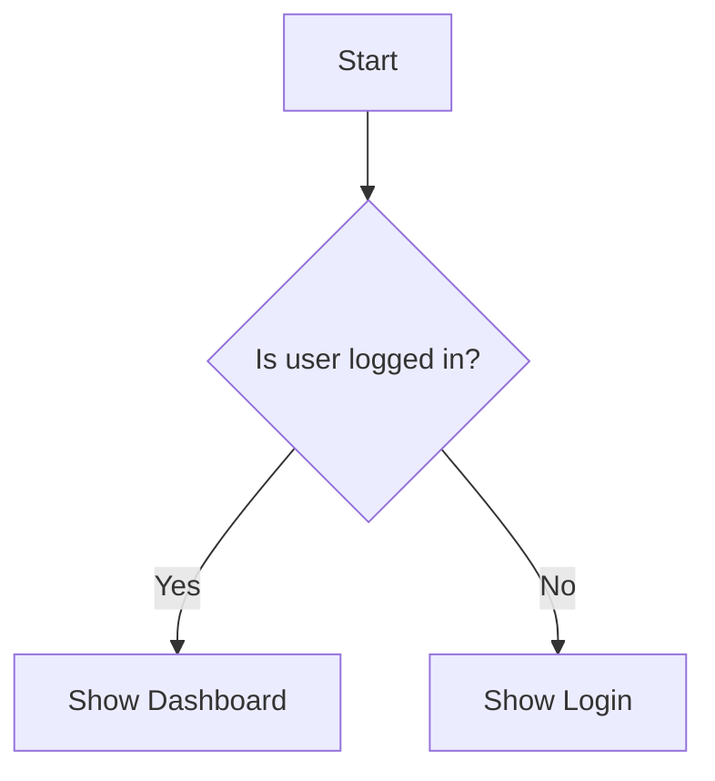

# Zero Source Developer Guide

## Introduction

Welcome to the Zero Source development ecosystem! This guide will walk you through the process of creating, sharing, and using Zero Source applications. As a developer, you'll be focusing primarily on writing detailed README files that describe your software's functionality and architecture, rather than writing the actual code.

## Getting Started

### Understanding the Zero Source Paradigm

Zero Source is a revolutionary approach to software development and distribution where:

1. **You describe, not code** - Instead of writing source code, you create detailed README files that describe what your software should do and how it should work.

2. **LLMs generate the implementation** - Large Language Models interpret your README and generate original source code that fulfills your specifications.

3. **Users run locally** - End-users download only your README file and use their local LLM tooling to generate and run the software.

4. **Software evolves automatically** - As LLM technology improves, the same README produces better implementations without any changes.

### Prerequisites

To develop Zero Source applications, you'll need:

- A solid understanding of software design principles
- Familiarity with technical writing and documentation
- Knowledge of the domain for which you're creating software
- Basic understanding of how LLMs interpret and generate code

## Development Workflow

### 1. Planning Your Application

Before writing your README, plan your application:

- Define the core purpose and functionality
- Identify the target audience and their needs
- Determine key features and user flows
- Consider technical requirements and constraints
- Sketch UI layouts and interaction patterns

### 2. Creating Your README

Follow these steps to create an effective Zero Source README:

1. Start with a clear project title and description
2. Detail the core functionality and features
3. Specify the user interface design and behavior
4. Describe the technical implementation details
5. Include any additional requirements (performance, accessibility, etc.)

Use the [Specification](specification.md) and [Best Practices](best-practices.md) documents as references.

### 3. Testing Your README

Before publishing, validate your README:

```bash
# Using the Zero Source CLI tool
npx @zerosource/cli validate ./my-app/README.md

# Using the web validator
curl -X POST -H "Content-Type: text/markdown" \
  --data-binary @./my-app/README.md \
  https://thereisnosource.com/api/validate
```

Additionally, test the generated implementation:

```bash
# Generate an implementation locally
npx @zerosource/cli generate ./my-app/README.md --output ./generated-app

# Run the generated application
cd ./generated-app && npm start
```

### 4. Publishing Your Zero Source App

Publish your Zero Source application to the thereisnosource.com repository:

```bash
# Using the Zero Source CLI
npx @zerosource/cli publish ./my-app/README.md --name "My App" --category "Productivity"
```

Or manually:
1. Fork the [thereisnosource.com repository](https://github.com/thereisnosource/zerosource-examples)
2. Add your README to the appropriate category
3. Submit a pull request

## README Structure

A complete Zero Source README typically includes:

### Required Sections

#### 1. Project Title and Description
```markdown
# My Project Title

## Description

A concise overview of what the application does and its key benefits.
```

#### 2. Functionality
```markdown
## Functionality

### Core Features
- Feature 1: Description
- Feature 2: Description

### User Interface
Detailed description of the UI layout and components.

### Behavior Specifications
Details on how the application should behave in different scenarios.
```

#### 3. Technical Implementation
```markdown
## Technical Implementation

### Architecture
Overview of the software architecture (e.g., MVC, microservices).

### Data Structures
Definitions of key data structures and their relationships.

### Algorithms
Explanation of important algorithms and processes.
```

### Recommended Optional Sections

#### Style Guide
```markdown
## Style Guide

Guidelines for visual design, including colors, typography, spacing, etc.
```

#### Testing Scenarios
```markdown
## Testing Scenarios

Specific test cases that the implementation should satisfy.
```

#### Accessibility Requirements
```markdown
## Accessibility Requirements

Guidelines for ensuring the application is accessible to all users.
```

## Advanced Techniques

### 1. Using Metadata Tags

Add metadata tags to provide hints to the LLM:

```markdown
<!-- ZS:COMPLEXITY:MEDIUM -->
<!-- ZS:PRIORITY:HIGH -->
<!-- ZS:PLATFORM:WEB -->
<!-- ZS:LANGUAGE:JAVASCRIPT -->
```

### 2. Including Diagrams

Use Mermaid syntax for diagrams:

```markdown

```

### 3. Specifying Data Models

Define data models clearly:

```markdown
### User Model

```javascript
{
  id: string,           // Unique identifier
  name: string,         // User's full name
  email: string,        // Valid email address
  role: "user" | "admin", // Permission level
  preferences: {
    theme: "light" | "dark",
    notifications: boolean
  }
}
```
```

### 4. Handling Platform-Specific Requirements

For multi-platform applications:

```markdown
## Platform-Specific Behavior

### Web
- Keyboard shortcuts: Ctrl+S for save
- Local storage for preferences

### Mobile
- Swipe gestures for navigation
- Touch-optimized buttons (min 44×44px)

### Desktop
- Native file system integration
- System tray integration
```

## Debugging and Troubleshooting

### Common README Issues

1. **Ambiguous Requirements**

   ❌ Problematic:
   ```markdown
   The app should be fast and user-friendly.
   ```

   ✅ Improved:
   ```markdown
   The app should respond to user input within 100ms and follow Material Design guidelines for consistent UI patterns.
   ```

2. **Inconsistent Terminology**

   ❌ Problematic:
   ```markdown
   Users can add items to their cart.
   ...
   The basket should display item quantities.
   ```

   ✅ Improved:
   ```markdown
   Users can add items to their cart.
   ...
   The cart should display item quantities.
   ```

3. **Insufficient Technical Detail**

   ❌ Problematic:
   ```markdown
   The app should store user data securely.
   ```

   ✅ Improved:
   ```markdown
   The app should:
   - Store user data in an encrypted SQLite database
   - Use AES-256 encryption for sensitive data
   - Keep authentication tokens in secure storage
   - Clear sensitive data when the app goes to background
   ```

### LLM Generation Issues

If the generated implementation doesn't match your expectations:

1. **Provide More Explicit Instructions**
   - Add more detail to ambiguous sections
   - Use examples to clarify expected behavior

2. **Check for Contradictions**
   - Ensure your requirements don't conflict
   - Maintain consistency throughout the document

3. **Simplify Complex Requirements**
   - Break complex features into smaller, well-defined components
   - Use diagrams to clarify relationships

## Collaborative Development

### Version Control

Track changes to your README using standard Git workflows:

```bash
# Initialize a repository
git init

# Add your README
git add README.md

# Commit changes
git commit -m "Initial README for MyApp"

# Create a branch for specific feature updates
git checkout -b enhance-search-feature

# After editing README
git commit -m "Enhanced search feature description"
```

### Collaborative Editing

For collaborative editing:

1. Use pull requests to propose changes
2. Review changes carefully for consistency
3. Maintain a change log at the bottom of your README
4. Consider using metadata comments to track authorship:

```markdown
<!-- ZS:AUTHOR:JaneDoe:SECTION:UserInterface -->
```

## Best Practices Checklist

Before finalizing your README, check that you've:

- [ ] Written a clear and concise description
- [ ] Detailed all core features and functionality
- [ ] Described the user interface comprehensively
- [ ] Specified technical implementation details
- [ ] Included examples where appropriate
- [ ] Addressed edge cases and error states
- [ ] Defined data structures and interfaces
- [ ] Specified performance requirements
- [ ] Considered accessibility needs
- [ ] Validated your README with the Zero Source tools
- [ ] Tested the generated implementation

## Resources

- [Zero Source Specification](specification.md)
- [Zero Source Best Practices](best-practices.md)
- [Example READMEs](../examples/)
- [Discord Community](https://discord.gg/thereisnosource)
- [CLI Tools](../tools/)

## Getting Help

If you encounter issues or have questions:

1. Check the [FAQ](https://thereisnosource.com/faq)
2. Join our [Discord community](https://discord.gg/thereisnosource)
3. Open an issue on our [GitHub repository](https://github.com/thereisnosource/zerosource-examples)
4. Contact us at support@thereisnosource.com

## Conclusion

Zero Source development represents a fundamental shift in how we think about software creation and distribution. By focusing on clear, detailed descriptions of your software's functionality and architecture—rather than the implementation details—you can create applications that evolve and improve automatically as LLM technology advances.

Happy building!