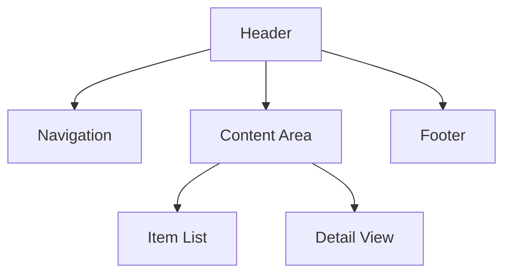

# Zero Source README Specification

## Overview

This document defines the formal specification for Zero Source README files. These files serve as the sole source of information for LLMs to generate functional software. Following this specification ensures that your README files contain all necessary information in a standardized format for optimal code generation.

## File Format

Each Zero Source README must be a valid Markdown (.md) file that follows this general structure:

```markdown
# Project Title

## Description
[General description of the software]

## Functionality
[Detailed functionality sections]

## Technical Implementation
[Technical details sections]

## [Additional Sections as needed]
```

## Required Sections

### 1. Project Title

The first line of the README must be a level 1 heading with the project name:

```markdown
# Project Name
```

### 2. Description

A concise overview of the software, explaining its purpose and key features:

```markdown
## Description

[1-3 paragraphs explaining what the software does and its primary use cases]
```

### 3. Functionality

Detailed explanation of user-facing features and behaviors:

```markdown
## Functionality

### Core Features
- [Feature 1]
- [Feature 2]
...

### User Interface
[Description of UI elements, layout, and components]

### Behavior Specifications
[Detailed explanation of how the software should behave in various scenarios]
```

### 4. Technical Implementation

Details on how the software should be implemented:

```markdown
## Technical Implementation

### Architecture
[Description of the software architecture, patterns, and organization]

### Data Structures
[Definitions of key data structures and their relationships]

### Algorithms
[Explanation of important algorithms and processes]
```

## Optional Sections

The following sections are recommended but not strictly required:

### Style Guide

```markdown
## Style Guide
[Visual design specifications, colors, typography, animations, etc.]
```

### Testing Scenarios

```markdown
## Testing Scenarios
[List of test cases that the implementation should satisfy]
```

### Accessibility Requirements

```markdown
## Accessibility Requirements
[Specifications for making the software accessible]
```

### Performance Goals

```markdown
## Performance Goals
[Metrics and targets for performance optimization]
```

### Extended Features

```markdown
## Extended Features
[Optional features that could enhance the software]
```

## Usage of Diagrams

Diagrams should be included using ASCII art, markdown tables, or Mermaid syntax to illustrate:
- UI layouts
- Architecture diagrams
- Data flow
- State machines

Example:

```markdown
### User Interface Layout


```

## Code Examples

Where appropriate, include example code snippets to illustrate expected behavior or data structures:

````markdown
```javascript
// Example data structure
{
  id: string,
  name: string,
  properties: {
    key1: value1,
    key2: value2
  }
}
```
````

## Metadata Tags

You can include special metadata tags to provide hints to the LLM:

```markdown
<!-- ZS:COMPLEXITY:MEDIUM -->
<!-- ZS:PRIORITY:HIGH -->
<!-- ZS:PLATFORM:WEB -->
<!-- ZS:LANGUAGE:JAVASCRIPT -->
```

## Validation Rules

To be considered valid, a Zero Source README must:

1. Include all required sections with appropriate content
2. Use proper Markdown formatting
3. Provide sufficient detail for implementation
4. Be self-consistent with no contradictory requirements
5. Not reference external sources or documentation
6. Be complete (all functionality must be described)

## Version Control

Each Zero Source README should include a version indicator:

```markdown
<!-- Zero Source Specification v1.0 -->
```

## Example README

See the [examples](../examples/) directory for complete examples of valid Zero Source READMEs.

## Extensions

The base specification can be extended with domain-specific requirements:

- **Web Applications**: Additional sections for routing, state management, API integration
- **Mobile Applications**: Platform-specific guidelines, native feature usage
- **Data Science**: Dataset descriptions, model specifications, evaluation metrics
- **Games**: Game mechanics, asset descriptions, level designs

## Compatibility

Zero Source READMEs should be:

1. Human-readable
2. Compatible with standard Markdown renderers
3. Optimized for LLM interpretation
4. Versioned in standard version control systems

## Schema

A formal JSON Schema for validating Zero Source READMEs is available in the tools directory.